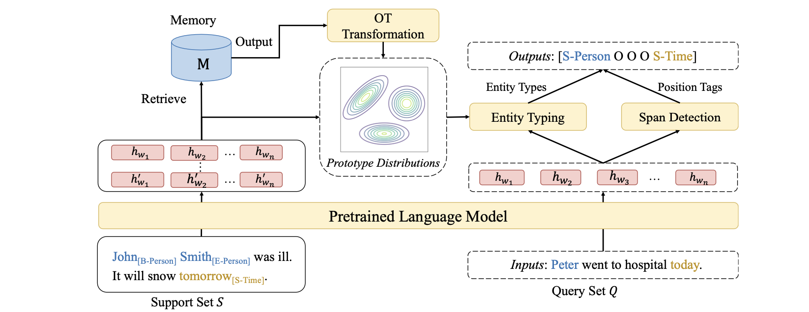

# MANNER: A Variational Memory-Augmented Model for Cross Domain Few-Shot Named Entity Recognition

This repository contains the official implementation of our paper [MANNER: A Variational Memory-Augmented Model for Cross Domain Few-Shot Named Entity Recognition](https://aclanthology.org/2023.acl-long.234.pdf) (ACL 2023).
<br>

# Introduction 

MANNER is a variational memory-augmented few-shot NER model. It uses a memory module to store information from the source domain and then retrieve relevant information from the memory to augment few-shot tasks in the target domain. Moreover, in order to effectively leverage the information from memory, MANNER uses optimal transport to retrieve and process information from the memory. 

 
<br>

# File Structure 
```data```: contains the datasets used in the experiments. 

```cross_dataset```: contains the code for the English Cross-Domain dataset. 

```chinese_cross_dataset```: contains the code for the Chinese Cross-Domain dataset. 

```saved_models```: contains the saved model checkpoints. 

```scripts```: contains some example scripts for training and evaluation.
<br>

# Requirements 
```
torch=1.7.1
transformers=3.4.0
scikit-learn=0.24.2
pot=0.7.0
seqeval 
``````

# Datasets
For English cross-domain datasets, you can download the dataset from [here](https://atmahou.github.io/attachments/ACL2020data.zip). In addition to the dataset, you also need to download the entity types of all the datasets from [here](https://drive.google.com/file/d/1hHo-RXjfuXluUrjaq6eEqtHaJAftuBYq/view?usp=drive_link). You can put the datasets and the entity types in the ```data``` folder. 
<br>

# Training and Evaluation 
We provide some examples of how to train and evaluate MANNER in the ```scripts``` folder. For example, if you want to train and evaluate the model on the ontonotes dataset in the 1-shot setting, you can simply run the command: 

```
bash scripts/ontonotes_1shot.sh 
```

Please refer to the appendix of our paper for the hyperparameter settings on each dataset.

Note: I am still cleaning the code for the Chinese Cross-Domain dataset and will upload the code soon.

---

**If you found the paper and the resources useful, please kindly cite our paper**:

```
@inproceedings{fang2023manner,
  title={MANNER: A Variational Memory-Augmented Model for Cross Domain Few-Shot Named Entity Recognition},
  author={Fang, Jinyuan and Wang, Xiaobin and Meng, Zaiqiao and Xie, Pengjun and Huang, Fei and Jiang, Yong},
  booktitle={Proceedings of the 61st Annual Meeting of the Association for Computational Linguistics (Volume 1: Long Papers)},
  pages={4261--4276},
  year={2023}
}
```

<br>

**Contact**:

If you have any questions, feel free to contact me via (fangjy6@gmail.com).

